# RPG 制作大师 MV 1.5.0 中新插件管理器的使用说明

RPG 制作大师 MV 在最新版本中增加了新的插件管理器，使得你可以创作超强的插件！下面是一个简单的例子：

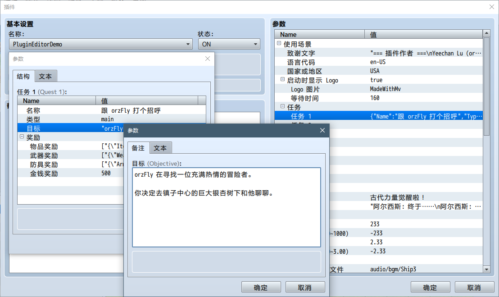

## 参数分组 (@parent)

使用 `@parent` 可以对参数进行分组，只需要在 `@parent` 后插入父参数的名字即可。

```javascript
/*:
 * @param C:\
 *
 * @param Windows
 * @parent C:\
 *
 * @param System32
 * @parent Windows
 *
 * @param notepad.exe
 * @parent System32
 *
 * @param shell32.dll
 * @parent System32
 *
 * @param explorer.exe
 * @parent Windows
 *
 * @param D:\
 *
 * @param Documents
 * @parent D:\
 */
```

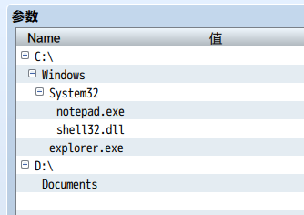

在游戏中，读取参数的方法没有变化。

```javascript
PluginManager.parameters('TreeDemo')['notepad.exe']
```

## 显示参数名字 (@text)

编辑器中显示的名字可以和参数的真实名字不一样了。使用 `@text` 来指定在编辑器中显示的参数名字。

```javascript
/*:
 * @param enable
 * @text Enable the Quest System
 * @default true
 *
 * @param mainmenu
 * @text Show in Main Menu
 * @parent enable
 */
```

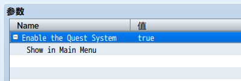

该名字仅用于显示，并不能在游戏中用以读取参数值。要在游戏中读取参数值，应使用 `@param` 的值而非 `@text` 。

```javascript
PluginManager.parameters('TextDemo')['enable']
// => "true"

PluginManager.parameters('TextDemo')['Enable the Quest System']
// => undefined
```

## 类型 (@type)

### 文本

```
@type text
```

这个指令将参数编辑器指定为一个单行的文本输入框，就和以前的参数编辑器一样。

如果你指定的 `@type` 值不合法，或者未指定 `@type` ，该参数会默认显示为文本类型。

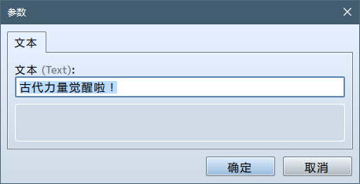

### 备注

```
@type note
```

这个指令将参数编辑器指定为一个多行文本输入框。

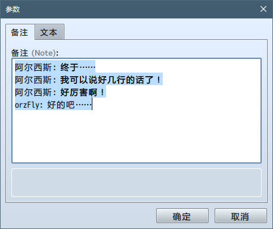

请注意：参数的设定值是一个 JSON 字符串。这意味着你需要在游戏中使用 `JSON.parse` 以读取该参数真正的值。

```javascript
var value = PluginManager.parameters('PluginEditorDemo')['Note']

console.log(value)
// => "Aluxes: Eventually...\nAluxes: I can say something longer than one line!\nAluxes: This is super powerful!\norzFly: Oh well..."

console.log(JSON.parse(value))
// => Aluxes: Eventually...
// => Aluxes: I can say something longer than one line!
// => Aluxes: This is super powerful!
// => orzFly: Oh well...
```

### 数字

```
@type number
```

这个指令将参数编辑器指定为一个带上下箭头的数值输入框。

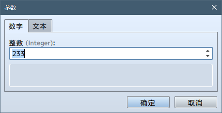

```
@max 100
@min -100
```

上面两个指令可以用来设置最大最小值。

```
@decimals 2
```

上面这个指令可用于设置小数位数。如果没有指定，那么在这个编辑器中只能输入整数。

### 文件

```
@type file
```

这个指令将参数编辑器指定为一个文件选择器，可以选择任意图片或者声音资源。

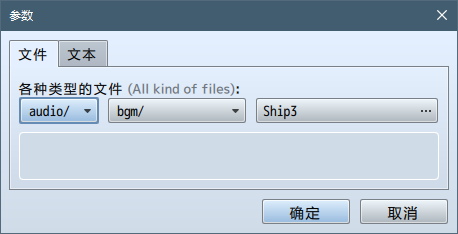

```
@dir audio/bgm/
```

上面这个指令将指定基准目录，这样文件选择器将只显示在基准目录下的文件。基准目录不会出现在参数的值中。

```
@require 1
```
如果上面这个指令存在，部署时“排除未选中的文件”选项将不会排除这个参数选中的文件。

### 对象选择器

```
@type animation
@type actor
@type class
@type skill
@type item
@type weapon
@type armor
@type enemy
@type troop
@type state
@type tileset
@type common_event
@type switch
@type variable
```

这些指令将参数编辑器指定为一个选择对象（动画、角色、变量等数据库对象）的选择器，对象的 ID 将会是参数的值。如果选中了“无”，则值为 0。

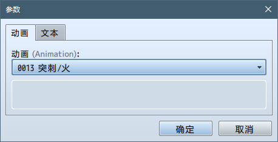
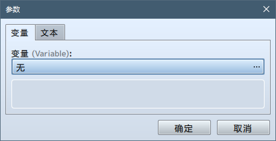

```
@require 1
```
（仅限 `@type animation`，即动画类型）如果上述指令存在，部署时“排除未选中的文件”选项将不会排除这个参数选中的动画。

### 布尔值

```
@type boolean
```

这个指令将参数编辑器指定为一个带有真/假两个选项的选择器，其默认文本是“ON”和“OFF”。

This directive will create the editor with two radio options returning a true/false value. The default labels are "ON" and "OFF".


```
@on Enable
@off Disable
```

使用上述两个指令你可以指定这两个单选框的文字。

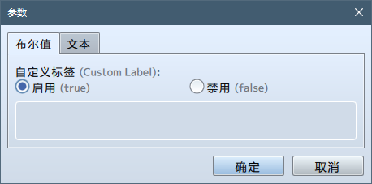

### 选项

```
@type select
@option XP
@option VX
@option VX Ace
@option MV
```

这个指令将参数编辑器指定为一个选择框，允许用户在下拉框中选择一个。该参数的值即为选项的名字。

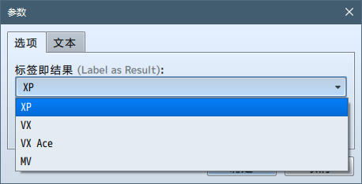

```
@type select
@option XP
@value 1.0
@option VX
@value 2.0
@option VX Ace
@value 2.1
@option MV
@value 3.0
```

你也可以使用上述 `@value` 指令指定每个选项对应的游戏中的值。

### 可编辑的选项

```
@type combo
@option XP
@option VX
@option VX Ace
@option MV
```

这个指令将参数编辑器指定为一个组合框，允许用户在下拉框中选择一个或自行输入内容。

不支持使用 `@value` 指定对应的值。

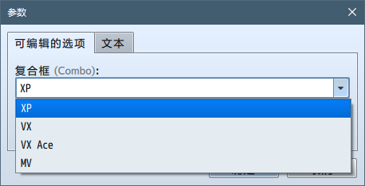

### 列表

在任意类型后添加 `[]`，编辑器将被指定为一个列表。例如，以下类型都是有效的：

```
@type text[]
@type note[]
@type number[]
@type variable[]
@type item[]
@type combo[]
@type file[]
@type struct<Anything>[]
```

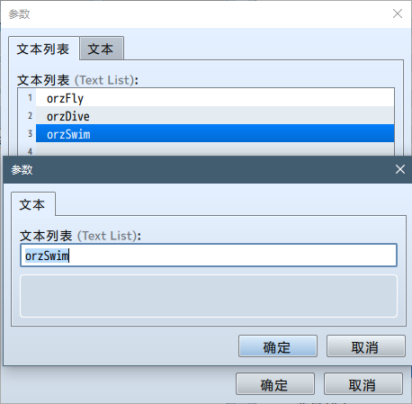

请注意：参数的设定值是一个 JSON 字符串。这意味着你需要在游戏中使用 `JSON.parse` 以读取该参数真正的值。

```javascript
var value = PluginManager.parameters('PluginEditorDemo')['Text List']

console.log(value)
// => ["orzFly","orzDive","orzSwim"]

console.log(value[2])
// => o

var realValue = JSON.parse(value)
console.log(realValue[2])
// => orzSwim
```

### 结构

使用新的块级注释可以声明一个新的结构，它可以放在主块级注释的后面。该块级注释的第一行定义了结构的名字（在下面的例子中是 ItemAward）。你可以像往常一样在结构块中定义参数和类型。

```
/*~struct~ItemAward:
 * @param Item
 * @type item
 * 
 * @param Count
 * @type number
 * @min 1
 * @max 99
 * @default 1
 */
```

运用一个特殊的类型可以在参数中使用定义好的结构：

```
@type struct<ItemAward>
```

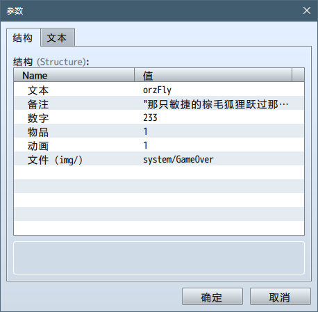

请注意：参数的设定值是一个 JSON 字符串。这意味着你需要在游戏中使用 `JSON.parse` 以读取该参数真正的值。

```javascript
var value = PluginManager.parameters('PluginEditorDemo')['Structure']

console.log(value)
// => {"Text":"orzFly","Note":"\"The quick brown fox jumps over the lazy dog.\\nThe lazy dog jumps over the quick brown fox.\\nThe quick brown fox jumps over the quick brown fox.\\nThe lazy dog jumps over the lazy dog.\"","Number":"233","Item":"1","Animation":"1","File (img/)":"system/GameOver"}

console.log(value["Text"])
// => undefined

var realValue = JSON.parse(value)
console.log(realValue["Text"])
// => orzFly
```

---

附件中有一个示例插件，同时也可以在  [GitHub](https://github.com/orzFly/rpgmaker-mv-plugins/blob/master/plugins/PluginEditorDemo.js) 上下载到。虽然插件没有任何功能，但它演示了RPG 制作大师 MV 1.5.0 中新插件管理器的功能。